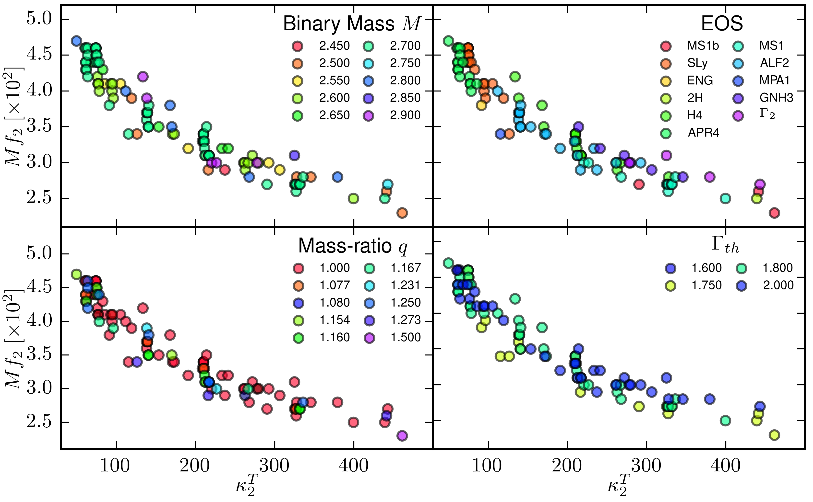

# Gravitational-wave post-merger data

Data from numerical relativity simulations of neutron star mergers.

The initial commit refers to data used in Fig.3 of [this paper](https://inspirehep.net/record/1358387) and computed there and elsewhere (see [references](#references) below).

## How to add data?

Please, push and extend the data collected here:

 * Add data to the file
 * Update the reference list below
 * Push to the repo, preferably with a single commit and clear message (e.g. "add frequencies f2 from Doe+ 2017")
 
## References

Please link to HEP-SPIRE and cite the refs when using the data.

 * [Bernuzzi+ (2015)](https://inspirehep.net/record/1358387)
 * [Takami+ (2015)](https://inspirehep.net/record/1333637)
 * [Hotokezaka+ (2013)](https://inspirehep.net/record/1244056)
